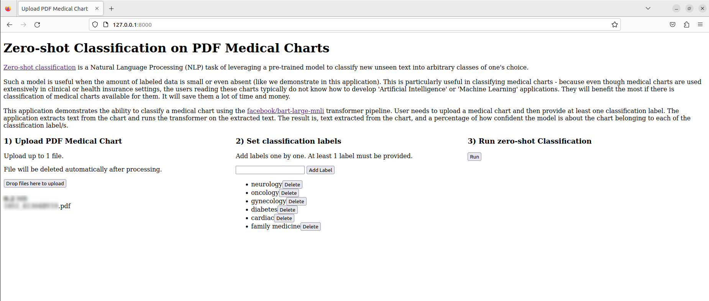
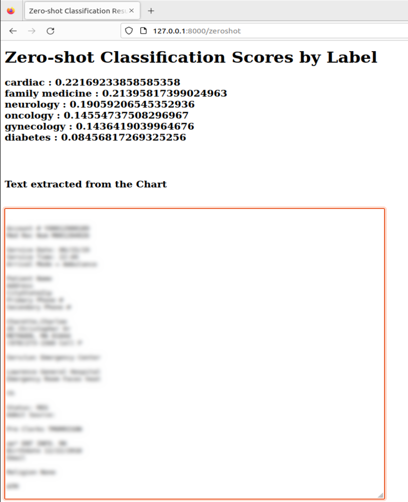

# NLP TRANSFORMER FOR MEDICAL CHARTS

***

## Description :-

<a href="https://huggingface.co/tasks/zero-shot-classification">Zero-shot classification</a>  Is a Natural Language Processing (NLP) task of leveragin a pre-trained model to classify new unseen text into arbitrary classes of one's choice.

Such a model is useful when the amount of labeled data is small or even absent (like we demonstrate in this application). This is particularly useful in classifying medical charts - because even though medical charts are used extensively in clinical or health insurance settings, the users reading these charts typically do not know how to develop 'Artificial Intelligence' or 'Machine Learning' applications. They will benefit the most if there is classification of medical charts available for them. It will save them a lot of time and money.

This application demonstrates the ability to classify a medical chart using the <a href="https://huggingface.co/facebook/bart-large-mnli">facebook/bart-large-mnli</a> transformer pipeline. User needs to upload a medical chart and then provide at least one classification label. The application extracts text from the chart and runs the transformer on the extracted text. The result is, text extracted from the chart, and a percentage of how confident the model is about the chart belonging to each of the classification label/s.

Screenshots towards the bottom of this page show one app run. 

***

## Setup :-

### (1) Create a virtual environment :- (skip if one of interest already exists)
```commandline
cd ~/
mkdir  my_dir_for_venvs
cd my_dir_for_virtual_envs
python3 -m venv my-venv
```

### (2) Activate the virtual environment :-
```commandline
source ~/my_dir_for_venvs/my-venv/bin/activate
```

### (3) Clone this repository :-
```commandline
cd ~/
git clone https://github.com/nsb700/nlp-medical-charts.git nlp-medical-charts
```

### (4) Install required dependencies by referring to requirements.txt :-
```commandline
cd ~/nlp-medical-charts
pip3 install -r requirements.txt
```

### (5) Install other required dependencies :-
```commandline
sudo apt update
sudo apt install tesseract-ocr
```

### (6) Specify param in app_params file :-
app_params has one entry :-
```commandline
tesseract_binary_path=/usr/bin/tesseract
```
After installing tesseract-ocr in step (5), change this value accordingly.

***

## Screenshots of the application run :-



